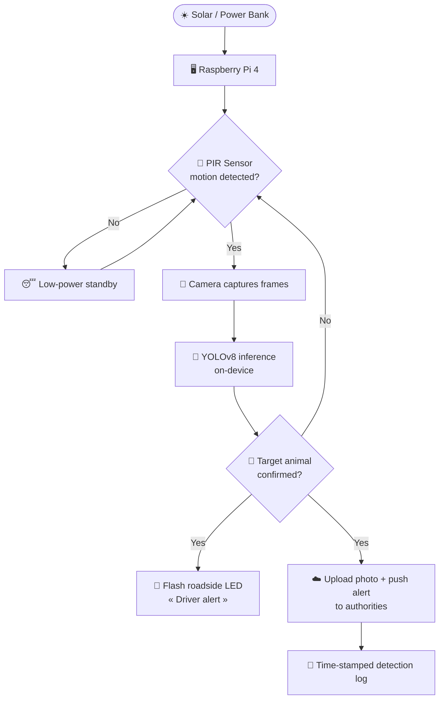

<div align="center">
## PAWS: PREDICTIVE ANIMAL WARNING SYSTEM 
<div align="center">

## 📖 The Story Behind PAWS

Animals don't cross roads randomly. They follow the **same paths for generations** — natural crossing points that become predictable *hotspots*. In rural areas and villages, these paths often cut straight across roads where people drive. When a driver can't see an animal in time, the result is a collision: damaged vehicles, injured people, and dead animals.

But while researching the problem, we discovered something bigger than road safety.

We spoke to local authorities and asked about animal-crossing accidents in these areas. Their answer was revealing: **they simply didn't know these accidents were happening** — because almost no one reports them. A minor collision with an animal is rarely considered "worth" an official report.

This creates a silent gap:

> **No information → No action.**
> Without data on *where* and *how often* animals cross, authorities can't plan warning signs, fencing, or patrols. The accidents keep happening, unnoticed and undocumented.

This matters most for **endangered species**. Large, high-profile animals get attention — but a tapir, already close to extinction, can be hit on a road and simply vanish from the record. No report. No data. No response. Each unreported loss is a quiet push toward extinction.

**PAWS was built to close that gap** — to protect drivers *and* to make every crossing visible, documented, and actionable.

---

## 💡 What PAWS Does

PAWS serves **two audiences at once**, the moment an animal is detected:

| 👁️ For Drivers                                                                                                                                         | 🛡️ For Authorities                                                                                                                                                                               |
| -------------------------------------------------------------------------------------------------------------------------------------------------------- | -------------------------------------------------------------------------------------------------------------------------------------------------------------------------------------------------- |
| A roadside**LED warning light flashes instantly**, telling approaching drivers to slow down — a real warning, only when a real animal is present. | A **push notification**, a **photo of the detected animal**, and a **time-stamped log entry** are delivered to a phone dashboard — turning invisible crossings into real data. |

Because the warning only triggers on a **confirmed animal** (not just any movement), drivers learn to trust it instead of ignoring it — solving the "boy who cried wolf" problem of ordinary motion sensors.

---

## ✨ Key Features

- 🧠 **On-device AI (edge computing)** — a custom-trained YOLOv8 model runs *locally* on the Raspberry Pi. Detection happens in **under a second**, with no dependence on the cloud for the safety-critical decision.
- 🎯 **Custom 8-class wildlife model** — trained specifically to recognise target species, not generic objects.
- 🛰️ **Two-stage detection** — a lightweight second model acts as a *"person veto"* (so a human is never mistaken for an animal) and a *"second opinion"* (to recognise extra species the main model wasn't trained on).
- 🔋 **Built for off-grid, 24/7 operation** — solar / power-bank friendly, with power-saving standby, thermal protection, and a power-bank keep-alive so it never silently shuts off.
- 📱 **Live IoT dashboard** — real-time camera stream, evidence gallery, detection log, and statistics, all in a phone app.
- 🚦 **Instant roadside alert** — a fast-blinking LED warns drivers directly at the scene.
- 📊 **Documentation, not just warnings** — every confirmed crossing is logged with a timestamp and photo, giving authorities the historical data they were missing.

---

## ⚙️ How It Works



**The logic in plain terms:**

1. **Sleep smart.** The system idles in low power. A **PIR motion sensor** acts as a wake-up trigger — the power-hungry camera and AI only switch on when something moves.
2. **Look carefully.** Once awake, the camera feeds frames to the **YOLOv8** model. To avoid false alarms, an animal must be seen in **several consecutive frames** before it counts.
3. **Double-check.** A second lightweight model confirms the target isn't actually a person and can re-label species the main model doesn't know.
4. **Act on both fronts.** On a confirmed animal, PAWS *simultaneously*:
   - blinks the **roadside LED** to warn drivers, and
   - sends a **photo + push notification + log entry** to authorities via the IoT dashboard.

---

## 🛠️ Hardware

| Component                                   | Role                                                                      |
| ------------------------------------------- | ------------------------------------------------------------------------- |
| **Raspberry Pi 4 Model B**            | Central processor — runs the AI, sensors, and dashboard link on the edge |
| **USB Web Camera**                    | Captures the scene for image recognition                                  |
| **PIR Motion Sensor**                 | Low-power "wake-up" trigger (BCM pin 4)                                   |
| **LED Warning Light**                 | Roadside driver alert (BCM pin 17)                                        |
| **Solar Panel + Power Bank**          | Off-grid, self-sustaining power for remote roadside placement             |
| **Weatherproof Enclosure + Heatsink** | Protects electronics; passive (fanless) cooling                           |

---

## 🧰 Tech Stack

- **Python** — core application language
- **[Ultralytics YOLOv8](https://github.com/ultralytics/ultralytics)** — object detection, exported to **NCNN** for fast ARM-native inference on the Pi
- **OpenCV** — camera capture and image processing
- **Flask** — serves the live MJPEG camera stream
- **Blynk IoT** — mobile dashboard, notifications, and remote control
- **ImgBB API** — hosts evidence snapshots for the app gallery

### The detection model

The custom YOLOv8 model is trained to recognise **8 classes**:

`monkey` · `boar` · `monitor lizard` · `tapir` · `tiger` · `dog` · `cat` · `black panther`

A second **YOLOv8-nano** model (general-purpose) runs *only when the main model already fires*, adding two safeguards without wasting power:

- **Person veto** — suppresses any "animal" that overlaps a detected human.
- **Second opinion** — recognises additional animals (cow, horse, sheep, elephant, bear, and more) that the custom model wasn't trained for.

Detection is further hardened with **per-class confidence thresholds**, a **box-size sanity filter** (rejects objects pressed against the lens), and **multi-frame temporal confirmation** — together driving the false-alarm rate close to zero.

---

## 📱 The IoT Dashboard

The Blynk mobile app is split into two layers:

- **Authority-facing layer** — online/offline status, live camera feed, and the latest captured animal photo with its species label and confidence score. Designed so a non-technical user can *see* what triggered an alert at a glance.
- **Internal monitoring layer** — a terminal-style event log, detection statistics, and a command channel for the development team to check the device's health remotely.

---

## 📂 Project Structure

```
PAWS/
├── paws_detect.py           # Detection engine — camera + YOLO + alert logic
├── blynk_controller.py      # Central bridge to the Blynk app; launches the engine
├── config.py                # Single source of truth: pins, thresholds, tuning
├── motion_sensor.py         # PIR / motion-sensor abstraction
├── requirements.txt         # Python dependencies
├── Paws_custom_ncnn_model/  # The custom-trained 8-class wildlife model
├── .env.example             # Template for your secret API keys
│
├── install_service.sh       # Installs PAWS as an auto-start system service
├── power_setup.sh           # Power / performance tuning for the Pi
├── paws.service             # systemd unit for boot-time startup
└── AUTOSTART.md             # Guide to running PAWS automatically on boot
```

---

## 🚀 Getting Started

> PAWS is designed for a Raspberry Pi 4 with a camera and PIR sensor, but the detection engine also runs on a desktop (using a webcam and software motion detection) for development.

**1. Clone and install dependencies**

```bash
git clone https://github.com/VisageEzra/PAWS.git
cd PAWS
pip install -r requirements.txt
```

**2. Set up your secret keys**

```bash
cp .env.example .env
```

Then open `.env` and fill in your own values:

```
IMGBB_API_KEY=your_imgbb_api_key_here
BLYNK_AUTH_TOKEN=your_blynk_auth_token_here
```

> ⚠️ Never commit your real `.env` — it's already listed in `.gitignore`.

**3. Run**

```bash
python blynk_controller.py
```

The controller connects to the Blynk app and launches the detection engine automatically. On the Pi, you can also have it **start on boot** — see [AUTOSTART.md](AUTOSTART.md).

---

## 🏆 Recognition

- 🥇 **Gold Medal** at the Diploma Project Exhibition.
- 👮 **Evaluated by serving law-enforcement officers** in a live demonstration, who rated its usability and notification speed at the highest level and saw value in expanding it to more high-risk roads.
- 💬 Recognised by industry reviewers as a practical, real-world solution.

---

## 👥 Shout-out to the Team

A final-year **Diploma in Information Technology** project — built by three of us. Massive thanks to my teammates who made PAWS happen 🙌

- 🐾 [**@VisageEzra**](https://github.com/VisageEzra) *(me)*
- 🐾 [**@PISHGG**](https://github.com/PISHGG) 
- 🐾 [**@Nvyyyyuu**](https://github.com/Nvyyyyuu) 

---

## 📝 Note

PAWS is a **student prototype**, evaluated under controlled demonstration conditions. Its underlying approach — combining low-power motion sensing, on-device computer vision, instant driver warnings, and authority-facing data logging — is designed to be adapted for real-world roadside deployment with further field testing.
